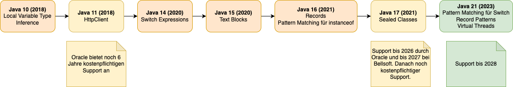
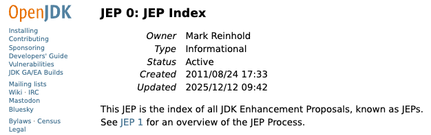
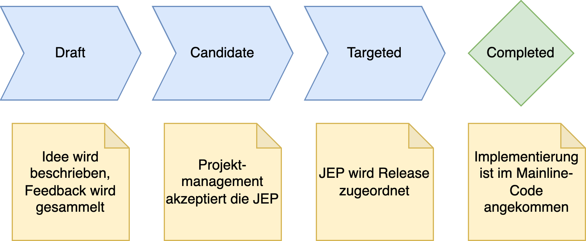
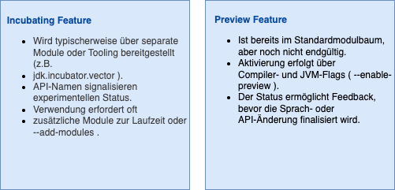
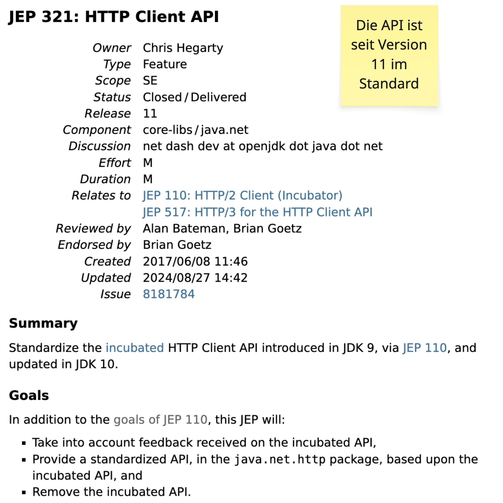

# Java seit Version 11 - Stand der Weiterentwicklung

---

## Historie

---

## JDK Enhancement Proposal (JEP)

Das JEP‐Verfahren ist das strukturierte Vorgehen, um neue Features, Refactorings oder Tooling‐Anpassungen in das JDK einzubringen.

[Link zum OpenJDK-JEP 0](https://openjdk.org/jeps/0)

---

## JDK Enhancement Proposal (JEP)

Eine JEP beschreibt:

* Motivation und Problemstellung
* Design‐Ansatz inklusive Diskussion alternativer Ideen
* Auswirkungen auf Kompatibilität
* Performance und Sicherheit
* Tests, Referenzimplementierung und Interaktion mit Spezifikationen

---

## JEP-Prozess

---

## JEP-Prozess

* JEPs können zwischen Releases verschoben oder verworfen werden.
* Features erst dann einkalkulieren, wenn eine JEP tatsächlich Targeted oder Completed ist.
* JEP‐Texte als Referenz für Architektur‐ und Coding‐Guidelines nutzen (z.B. Pattern Matching, Records).
* Frühzeitig Preview‐ oder Early‐Access‐Builds testen, wenn eine JEP den eigenen Code betrifft.

---

## Incubating- vs. Preview-Features

---

## Beispiel: JEP 321

