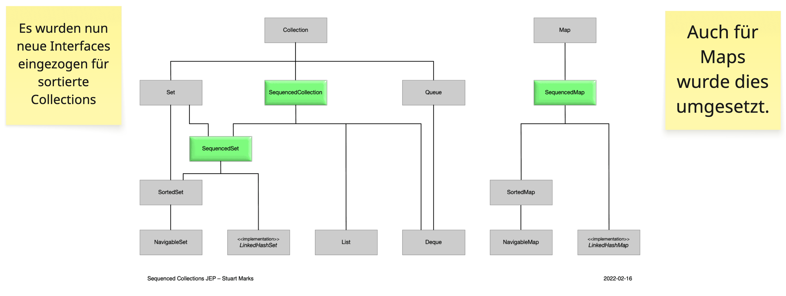

<style>
img[alt~="center"] {
  display: block;
  margin: 0 auto;
}
</style>

# Sequenced Collections Interface

---

## Bisheriger Stand

In der Collection-API war die Sortierung von Collections bisher nur optional. Es gab daher keine gemeinsamen Methoden,
die eine Sortierung voraussetzen würden.

||Erstes Element ermitteln|Letztes Element ermitteln
|---|---|---
|`List`|`list.get(0)`|`list.get(list.size()-1)`
|`Deque`|`deque.getFirst()`|`deque.getLast()`
|`SortedSet`|`sortedSet.first()`|`sortedSet.last()`
|`LinkedHashSet`|`lhs.iterator().next()`|_Keine direkte Entsprechung_

---

## Klassenhierarchie



---

<style scoped>
pre {
   font-size: 0.4rem;
}
</style>

## SequencedCollection<T>

```java
public interface SequencedCollection<E> extends Collection<E> {
   
    SequencedCollection<E> reversed();
     
    // ...
    
    default E getFirst() {
        return this.iterator().next();
    }

    default E getLast() {
        return this.reversed().iterator().next();
    }

    default E removeFirst() {
        var it = this.iterator();
        E e = it.next();
        it.remove();
        return e;
    }

    default E removeLast() {
        var it = this.reversed().iterator();
        E e = it.next();
        it.remove();
        return e;
    }
    
    default void addFirst(E e) {
        throw new UnsupportedOperationException();
    }

    default void addLast(E e) {
        throw new UnsupportedOperationException();
    }
}
```

---

## Implementierungen

- `List` und `Deque` erben `SequencedCollection`
- `SortedSet`/`NavigableSet` und `LinkedHashSet` implementieren `SequencedSet`
- `SortedMap`/`NavigableMap` sowie `LinkedHashMap` implementieren `SequencedMap`
- `HashSet`/`HashMap` bleiben außen vor (keine garantierte Encounter-Order)

---

## Reversed-Ansicht

- `reversed()` liefert eine Live-Ansicht (O(1)), keine Kopie
- Änderungen im View wirken zurück und umgekehrt
- Unmodifizierbare Collections bleiben auch rückwärts unmodifizierbar

---

## SequencedMap: neue Methoden

```java
SequencedMap<K, V> map = ...
map.firstEntry();  map.lastEntry();
map.pollFirstEntry();  map.pollLastEntry();
map.putFirst(k, v);    map.putLast(k, v);
map.reversed();

map.sequencedEntrySet();
map.sequencedKeySet();
map.sequencedValues();
```

---

## Fehlerfälle & Nebenbedingungen

- `getFirst()/getLast()` und die `remove…`-Methoden werfen `NoSuchElementException` bei leeren Collections
- Keine `peek`-Variante
- `addFirst()/addLast()` dürfen `UnsupportedOperationException` werfen (z. B. unmodifizierbare Collections)

---

## Fazit

- Iterator-Tricks wie `iterator().next()` entfallen
- Einheitliches API für alle Collections mit stabiler Encounter-Order
- Erleichtert Utility-Code in Libraries und Tests
