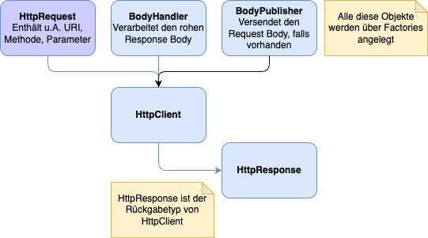

<style>
img[alt~="center"] {
  display: block;
  margin: 0 auto;
}
</style>

# Java Native HttpClient

---

## Überblick

* Zeitgemäße Alternative zu HttpURLConnection
* Neue API für HTTP-Anfragen
* Verbessert Java-Webkommunikation
* Ermöglicht HTTP/2-Unterstützung
* Einfacherer und flexiblerer Code

---

<style scoped>
pre {
   font-size: 0.3rem;
}
</style>

## Was ist das Problem mit HttpURLConnection?

```java
// Beispiel: Eine einfache POST-Anfrage mit HttpURLConnection
// (zeigt die typischen Schwächen der alten API)

URL url = new URL("https://example.com/api");
HttpURLConnection conn = (HttpURLConnection) url.openConnection();

try {
    // Schon das Setzen der Methode ist umständlich und wirft checked Exceptions
    conn.setRequestMethod("POST");

    // Redirects, Timeouts, Header → alles manuell und inkonsistent
    conn.setInstanceFollowRedirects(false);
    conn.setConnectTimeout(5000);
    conn.setReadTimeout(5000);
    conn.setDoOutput(true);
    conn.setRequestProperty("Content-Type", "application/json");

    // Body schreiben (kein Try-with-resources möglich ohne Verrenkungen)
    OutputStream os = conn.getOutputStream();
    os.write("{\"msg\":\"hello\"}".getBytes(StandardCharsets.UTF_8));
    os.flush();
    os.close(); // manuelles Schließen zwingend

    int status = conn.getResponseCode();

    // Fehler-Stream vs. Input-Stream: umständliche if/else-Logik
    InputStream is = (status >= 400)
            ? conn.getErrorStream()
            : conn.getInputStream();

    // Stream-Auslesen ist komplett manuell
    BufferedReader br = new BufferedReader(new InputStreamReader(is));
    StringBuilder response = new StringBuilder();
    String line;
    while ((line = br.readLine()) != null) {
        response.append(line);
    }
    br.close(); // wieder manuelles Schließen

    System.out.println("Status: " + status);
    System.out.println("Response: " + response);

} finally {
    // Verbindung explizit disconnecten – vergessen viele
    conn.disconnect();
}
```

---
<style scoped>
section > h2 {
  position: absolute;
  top: 110px;
  left: 80px;
}
</style>

## HttpClient-API



---

## HttpClient Builder

```java
var client = HttpClient.newBuilder()
              .version(HttpClient.Version.HTTP_1_1)        // HTTP2 ist auch möglich
              .followRedirects(HttpClient.Redirect.NEVER)  // unterbindet alle Redirects
              .build();
```

---

## HttpClient: Weitere Einstellungen

```java
HttpClient.newBuilder()
              .connectTimeout(Duration.ofSeconds(10))
              .executor(Executors.newFixedThreadPool(4))
              .build();
```

> **Connect Timeout**
> Zeit beim Verbindungsaufbau, die vergeht, bis eine HttpConnectTimeoutException geworfen wird.
> **Executor**
> Wird verwendet, wenn asynchrone HTTP-Aufrufe vorgenommen werden.

---

## HttpClient: Verwendung

```java
// Der HttpClient ist AutoCloseable und kann daher bei try-with-resources genutzt werden
try(var client = HttpClient.newBuilder().build()) {
    URI uri = URI.create("https://api.restful-api.dev/objects");
    // Wir verwenden einen Builder, um den Request zu bauen
    var request = HttpRequest.newBuilder().GET().uri(uri).build();
  
    // Der BodyHandler verarbeitet den HTTP response body
    var responseHandler = HttpResponse.BodyHandlers.ofString();
    
    // send() is synchronous
    HttpResponse<String> response = client.send(
        request,
        responseHandler
    );
    
    System.out.println(response.body());
}
```

---
<style scoped>
pre {
   font-size: 0.5rem;
}
</style>

## HttpClient: BodyHandler

```java
// String - Be aware of memory consumption.
HttpResponse<String> response = client.send(
    request,
    HttpResponse.BodyHandlers.ofString(StandardCharsets.UTF_8)
);

// byte[] - Be aware of memory consumption.
HttpResponse<byte[]> response = client.send(
    request,
    HttpResponse.BodyHandlers.ofByteArray()
);

// InputStream
HttpResponse<InputStream> response = client.send(
    request,
    HttpResponse.BodyHandlers.ofInputStream()
);

// Path
Path target = Paths.get("download.bin");

HttpResponse<Path> response = client.send(
    request,
    HttpResponse.BodyHandlers.ofFile(target)
);
```

---

## HttpClient: POST

```java
String jsonPayload = "{\"key\":\"value\"}";

HttpRequest postJsonRequest = HttpRequest.newBuilder()
    .uri(URI.create("https://api.example.com/data"))
    .header("Content-Type", "application/json")
    .POST(BodyPublishers.ofString(jsonPayload))
    .build();

HttpResponse<String> postJsonResponse =
    client.send(postJsonRequest, BodyHandlers.ofString());
```

---
<style scoped>
pre {
   font-size: 0.6rem;
}
</style>

## BodyPublisher

```java
// String
HttpRequest request = HttpRequest.newBuilder(uri)
    .POST(HttpRequest.BodyPublishers.ofString("hello world"))
    .build();

// byte[]
HttpRequest request = HttpRequest.newBuilder(uri)
    .POST(HttpRequest.BodyPublishers.ofByteArray(bytes))
    .build();

// InputStream
HttpRequest request = HttpRequest.newBuilder(uri)
    .POST(HttpRequest.BodyPublishers.ofInputStream(() -> myInputStream))
    .build();

// Path
HttpRequest request = HttpRequest.newBuilder(uri)
    .POST(HttpRequest.BodyPublishers.ofFile(Paths.get("data.json")))
    .build();
```

---

## HttpClient: Asynchrone Verwendung

```java
try(var client = HttpClient.newBuilder().build()) {
    URI uri = URI.create("https://api.restful-api.dev/objects");
    var request = HttpRequest.newBuilder().GET().uri(uri).build();
    var responseHandler = HttpResponse.BodyHandlers.ofString();
    
    CompletableFuture<HttpResponse<String>> response = client.sendAsync(
                request,
                responseHandler);
    response.thenAccept(System.out::println);
}
```

Beim Aufruf von sendAsync() erhalten wir die Antwort asynchron als CompletableFuture.
