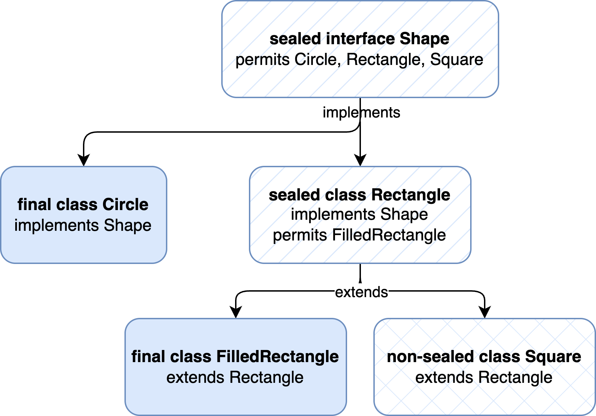

<style>
img[alt~="center"] {
  display: block;
  margin: 0 auto;
}
</style>

# Sealed Classes

---

## Sealed Classes: Überblick

* Sealed Classes/Interfaces begrenzen, welche Typen eine Klasse erweitern oder ein Interface implementieren dürfen.
* Das verbessert Modellierung, Kapselung und statische Prüfungen (z. B. bei Pattern Matching).
* Nach zwei Preview‑Runden in JDK 15/16 sind Sealed Types mit JDK 17 final.

---


## Deklaration und _permits_

Die grundlegende Schreibweise sieht folgendermaßen aus:

```java
public sealed class Payment permits CardPayment, WirePayment { /* … */ }
```

* `Payment` kann nur von `CardPayment` und `WirePayment` direkt erweitert werden
* Weitere Subklassen sind nicht vorgesehen
* Das erleichtert Lesernn des Codes sowie Tools und Compiler, die Struktur der Domäne zu verstehen.

---

## Sealed Classes: Kernregeln

- Jede _permitted subclass_ muss explizit als `final`, `sealed` oder `non-sealed` deklariert sein; ohne einen dieser Modifizierer führt die Kompilierung zu einem Fehler.
- Versiegelter Typ und erlaubte Subtypen müssen sich im gleichen Modul befinden (bzw. im Unnamed‑Modul im gleichen Paket).
- Die `permits`‑Liste kann entfallen, wenn alle direkten Subtypen im gleichen Source‑File stehen.

---

<style scoped>
section > h2 {
  position: absolute;
  top: 110px;
  left: 80px;
}
</style>

## Sealed Classes und Interfaces: Beispiel



---

<style scoped>
pre {
   font-size: 0.58rem;
}
</style>

## Sealed Classes und Interfaces: Beispiel


```java
public sealed interface Shape permits Circle, Rectangle, Square { }

public final class Circle implements Shape {
    private final double r;
    public Circle(double r) { this.r = r; }
    public double r() { return r; }
}

public sealed class Rectangle implements Shape permits FilledRectangle {
    private final double w, h;
    public Rectangle(double w, double h) { this.w = w; this.h = h; }
    public double w() { return w; }
    public double h() { return h; }
}

public final class FilledRectangle extends Rectangle {
    public FilledRectangle(double w, double h) { super(w, h); }
}

public non-sealed class Square implements Shape { // „bricht die Versiegelung“
    private final double a;
    public Square(double a) { this.a = a; }
    public double a() { return a; }
}
```
