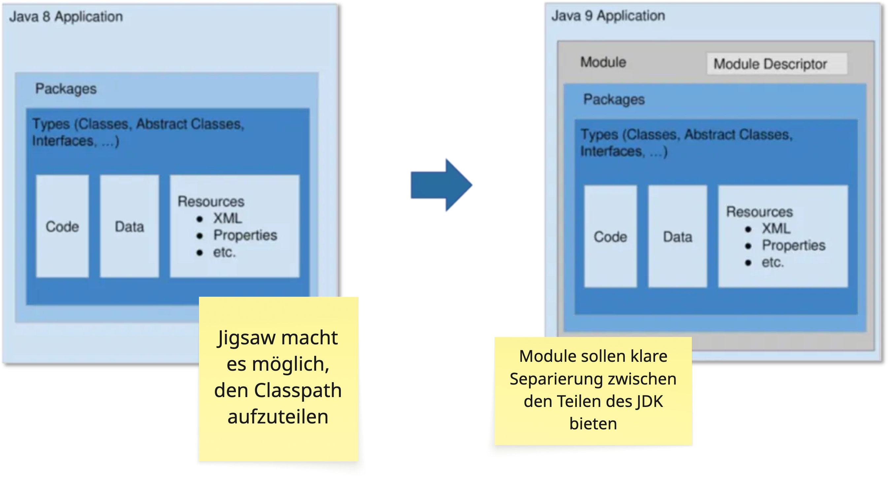
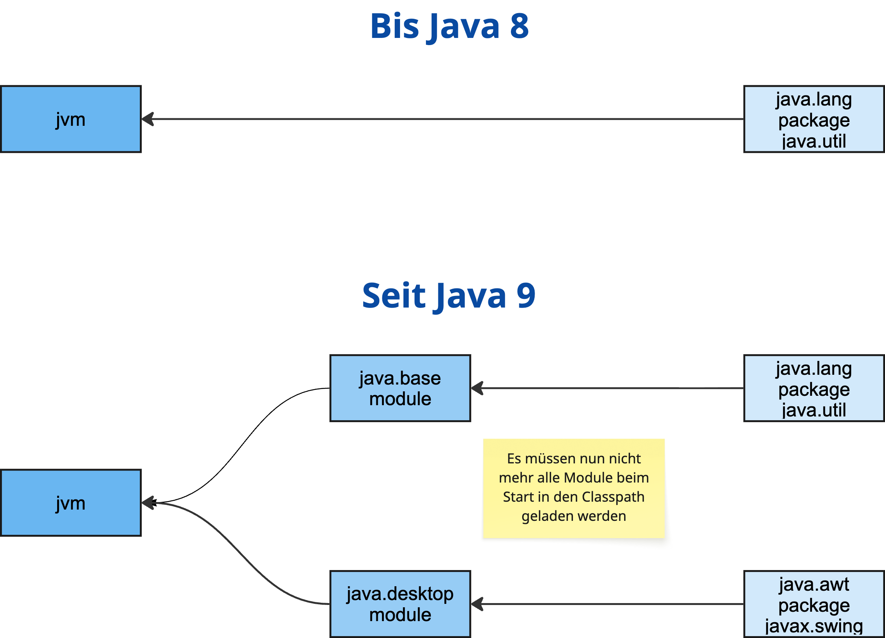
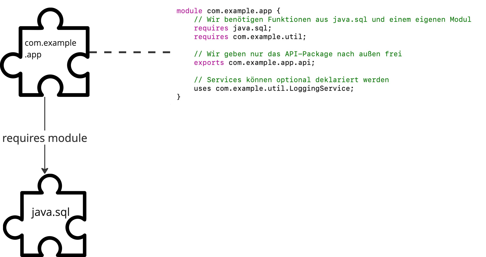

<style>
img[alt~="center"] {
  display: block;
  margin: 0 auto;
}
p > pre {
  font-size: 0.9rem
}
</style>

# Kapselung der Interna und Deprecations

---

## Starke Kapselung

* Nahezu alle Abhängigkeiten (Frameworks, Libraries, JDK-APIs, eigene Projekte) bestehen aus:
  * öffentlichen, stabilen APIs
  * internem Code, der die öffentliche API unterstützt
* Ziel: Vermeidung unbeabsichtigter Nutzung interner APIs
* Ergebnis: robustere, besser wartbare Projekte

---

## Starke Kapselung

* OpenJDK-Codebasis wird laufend refaktoriert: Code wird verändert, verschoben, gelöscht
* Öffentliche API bleibt stabil – sie ist der Vertrag mit Java-Nutzern
* Trennung zwischen öffentliche API und interne Implementierung ist entscheidend:
  * interne Nutzung kann bei jedem Minor-Update brechen
kann JDK-Upgrades blockieren
  * Gleichzeitig bieten interne APIs manchmal einzigartige Fähigkeiten

---

## Starke Kapselung

* Nur exportierte oder geöffnete Packages eines Moduls sind zugänglich
* Alles andere gilt als intern und unzugänglich
* Seit Java 9 ist das JDK in Module aufgeteilt
* Folge: Interne APIs werden standardmäßig verborgen

---

## Project Jigsaw – Überblick (Java 9)

**Ziel**: Langfristige Modularisierung der Java-Plattform und von Anwendungen

**Kernbausteine**:

* module-info.java zur Definition von Exports und Dependencies
* Module Path als Ersatz/Ergänzung zum Classpath

---

## Vorteile der Modularisierung von Java

* Klare Kapselung: Nur explizit exportierte Packages sind sichtbar
* Stärkere Integrität & Sicherheit des Codes
* Schnellere Startzeiten und kleinere Runtime-Images durch maßgeschneiderte JREs (jlink)
* Verbesserte Wartbarkeit großer Codebasen

---



---



---



---

## Wichtige APIs

**`java.*`**

* öffentliche API
* aber: nur öffentliche Member öffentlicher Klassen
* weniger sichtbare Klassen/Member sind intern
* Modul-System kapselt sie stark

---

## Wichtige APIs

**`sun.*`**

* fast vollständig intern
* Ausnahmen:
  * `sun.misc.*` und `sun.reflect.*` werden vom Modul `jdk.unsupported` exportiert/geöffnet
  * bieten kritische Funktionalität (z.B. `sun.misc.Unsafe`)
* Grundregel: `sun.*` vermeiden

---

## Wichtige APIs

**`com.sun.*`**

* JDK-spezifisch, nicht Teil des Java-Standards
* ca. 90 % intern (nicht exportiert)
* ca. 10 % exportiert durch jdk.*-Module → dürfen verwendet werden
* Exportierte Pakete werden kompatibel weiterentwickelt

---

## Beispiel: Compile Error

```java
import sun.security.x509.X500Name;

public class Test {
    public static void main(String[] args) {
        var name = new X500Name("CN=Test");
        System.out.println(name);
    }
}
// Error: package sun.security.x509 is not visible
```

kompiliert wieder mit:
`javac --add-exports java.base/sun.security.x509=ALL-UNNAMED Test.java`

---

## Beispiel: Laufzeitfehler

```java
import java.lang.reflect.Field;

public class Test {
    public static void main(String[] args) throws Exception {
        Field value = String.class.getDeclaredField("value");
        value.setAccessible(true); // bricht seit Java 9
        byte[] data = (byte[]) value.get("hello");
        System.out.println(data.length);
    }
}
// InaccessibleObjectException: Unable to make field 
// private final byte[] java.lang.String.value accessible
```

Läuft wieder mit
`java --add-opens java.base/java.lang=ALL-UNNAMED Test.java`
